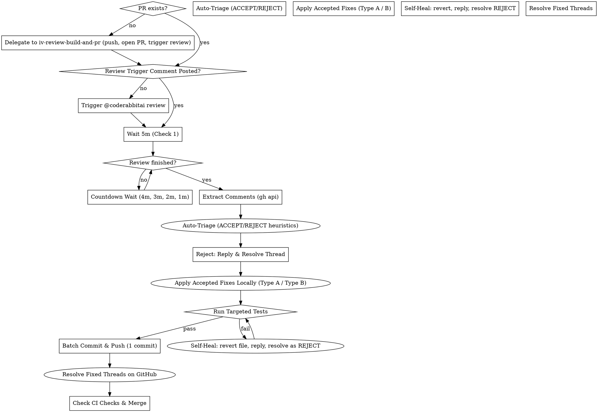

# Station V: Babysit PR and Merge (`v-babysit-pr-and-merge`)

A global, model-agnostic habit: ensure every branch is pushed and opened as a PR (or handed off directly from Station IV `iv-review-build-and-pr`), then sit on the PR through review until it is mergeable. Every comment is triaged, every dismissal carries a reason, review waiting follows a deterministic **5m → 4m → 3m → 2m → 1m** countdown check cycle, the review loop runs **exactly one focused round** (to conserve CodeRabbit quota and eliminate review churn), auto-triggers `@coderabbitai review` if auto-review is not invoked or was skipped, and concludes — merged or escalated.

## Pipeline Position
- **Station:** Station V of VI
- **Previous Station:** `iv-review-build-and-pr` (Review & Ship)
- **Next Station:** `vi-close-pipeline` (Close Pipeline — prune, issue close, clean-exit gate)

**Zero human in the loop.** Extraction, triage, rejection replies, thread resolution, code application, test verification, self-healing, commit, push, and merge are all performed autonomously by the agent. The operator is contacted only if critical blockers cannot be resolved.

## When to use

- Hand-off immediately after Station IV (`iv-review-build-and-pr`) to track CodeRabbit review and merge the PR.
- Working changes or commits exist on a feature branch with no PR yet — Station V delegates opening to `iv-review-build-and-pr`, then starts babysitting once the PR exists.
- A PR was created or pushed, requiring CodeRabbit review tracking.
- Review comments arrive on an open PR.
- Before merging, to confirm zero unhandled blocking feedback.

## Multi-PR Priority Order & Pipelining

Multiple open PRs and no specific number → follow `references/multi-pr-pipelining.md`
(stack dependencies first; pipelining only inside wait windows).

---

## The Review Loop



---

### Step 0 — Ship Handshake (PR Found or Delegated to `iv-review-build-and-pr`)

If a PR already exists for the current branch:
1. Find it: `gh pr list --head <branch-name> --state open --json number,title,url` (or `gh pr view` if the number is known).
2. **Acknowledge to the operator which PR was found** — number, title, and URL (e.g. `Found PR #128: <title> — <url>`).
3. Record the PR number and proceed directly to Step 1.

If no PR exists: **do not create it yourself — delegate to `iv-review-build-and-pr`** (its review, type-matched reviewers, test gate, and PR standards apply). Invoke `iv-review-build-and-pr`, let it open the PR and post the `@coderabbitai review` comment, then resume this skill at Step 1 with the newly created PR.
1. **Pre-flight & Base Branch Sync:** (handled inside `iv-review-build-and-pr`)
   - Detect base branch (e.g. `origin/master` or `origin/main`):
     ```bash
     gh repo view --json defaultBranchRef -q .defaultBranchRef.name
     ```
   - Fetch and merge the base branch so the branch is fully up-to-date:
     ```bash
     git fetch origin <base> && git merge origin/<base> --no-edit
     ```
2. **Review & Quality Verification:** (handled inside `iv-review-build-and-pr`)
   - Type-matched parallel review; fixes applied before push.
   - **No separate full-suite run here** — `iii-build-plan` already ran the suite per task, and GitHub CI will run it again on push. Local re-runs at this point are redundant; CI on the PR is the merge gate.
3. **Commit & Push:** (handled inside `iv-review-build-and-pr`)
   ```bash
   git status
   git add <files>
   git commit -m "<type>(<scope>): <summary>"
   git push -u origin <branch-name>
   ```
4. **Open PR with Semantic Context:** (handled inside `iv-review-build-and-pr`)
   - Detect linked issue if present in branch name (e.g. `issue-61` -> `Closes #61`).
   - `iv-review-build-and-pr` creates the PR with `@coderabbitai summary` in the body and posts `@coderabbitai review` immediately.
   - Record PR number and URL.

---

### Step 1 — Review Trigger & Countdown Polling Cycle (5m → 4m → 3m → 2m → 1m)

1. **Verify the Review Trigger (`iv-review-build-and-pr` posts it at PR creation, babysitter verifies):**
   - CodeRabbit does **not** auto-review anymore — reviews start only from an explicit `@coderabbitai review` comment, which `iv-review-build-and-pr` posts immediately after opening the PR. By the time this station starts, the review is therefore usually already running.
   - **Consume Station IV's trigger-status handoff first (do not re-detect):** Station IV's handoff report already states the trigger status in one line — review started / rate limited (N minutes) / other bot reply (quoted, with jump links to the trigger comment and CodeRabbit's reply) / no acknowledgement. Carry that status forward as the initial review state:
     - `review started` → go straight to the check-first below (review may already be posted).
     - `rate limited (N minutes)` → do NOT start the countdown for the quota window; go directly to Step 2B's reuse path (Station IV's review evidence + delta check). The N-minute window is reported to the operator, never silently waited out.
     - `other bot reply` / `no acknowledgement` → treat as not-started: re-verify the bot's last reply via the jump links / API (state may have advanced since IV's handoff), and if still not triggered, follow the fallback below.
   - If this skill was invoked on a PR that has no review trigger comment yet (e.g. the PR was opened outside `iv-review-build-and-pr`, or the comment is missing), post it now — do not wait:
     ```bash
     gh pr comment <pr-number> --body "@coderabbitai review"
     ```
   - Output note: `Triggered CodeRabbit review via PR comment.`

2. **Check-First — Never Wait Blind (MANDATORY before any countdown):**
   - Immediately after verifying the trigger, pull the PR's current comments AND inline review threads before starting any wait timer:
     ```bash
     gh pr view <pr-number> --json comments,reviews --jq "[.comments[] | {author: .author.login, body: .body[0:200]}]"
     gh api repos/:owner/:repo/pulls/<pr_number>/comments --paginate --jq ".[] | {id, path, line, body: .body[0:200]}"
     ```
   - If actionable review content (summary review, inline findings) is ALREADY posted: skip the entire 5m → 4m → 3m → 2m → 1m countdown and proceed directly to Step 2 extraction & triage. Output note: `Review already posted — countdown skipped, proceeding to triage.`
   - Start the countdown ONLY when no review content exists yet (only the trigger comment and/or the bot's invocation ack are present).
   - Rationale: CodeRabbit often finishes fast or the skill resumes after a delay; waiting a full 5 minutes while comments sit ready wastes a cycle and ignores available work.

3. **Read Every New CodeRabbit Comment — Differentiate Its Kind:**
   On each countdown check, read every comment CodeRabbit posted since the last check. Classify each one before acting:
    - **Usage-limit / status comments** — e.g. `## Review limit reached`, `rate limited by coderabbit.ai`, `Next included review available in N minutes`, `Review skipped: ...`. These carry **no review content**. Action: do NOT wait for the quota — skip immediately to the manual review fallback (Step 2B, agent fallback review).
   - **Actual review content** — a summary review, actionable inline comments, findings, or information relevant to the diff. These are the working output. Action: proceed to Step 2 extraction and triage on them.
   - Never treat a usage-limit comment as a completed review, and never treat a summary-only comment as the end of review comments still being posted. A green check can still mean `Review skipped` — read the text, not the color.

4. **Priority & Fallback Strategy:**
   - **Priority 1**: Let CodeRabbit perform its single review pass.
   - **Priority 2 (Rate Limit / Quota Exceeded)**: If a usage-limit comment says the review limit has been reached, do NOT wait. Go to Step 2B — reuse path first (Station IV's review evidence + delta check); the full subagent fallback only if reuse does not apply.
   - **Priority 3 (No Stall)**: Never stall development on third-party quotas.

5. **Countdown Polling Schedule (5m → 4m → 3m → 2m → 1m):**
   - Use the non-blocking `schedule` tool (or non-blocking background timers in agent environments) instead of long blocking shell sleeps.
   - **HARD RULE — never shorten the waits.** The first wait is a **minimum of 5 minutes**; never substitute 30s/60s/"quick check" timers. Reviews typically take 2–5 minutes to appear; do not decompose the 5-minute wait into short timers.
     - **Check 1**: After **5 minutes** (300s).
     - **Check 2**: If not finished, wait **4 minutes** (240s).
     - **Check 3**: If not finished, wait **3 minutes** (180s).
     - **Check 4**: If not finished, wait **2 minutes** (120s).
     - **Check 5+**: If not finished, poll **every 1 minute** (60s) (up to ~16-18 mins total timeout).
   - *If other open PRs exist with actionable feedback, pipeline and work on them during these windows.*

6. **Completion Inspection (classify honestly — never invent a clean pass):**
   - Check review state:
     ```bash
     gh pr view <pr-number> --json comments,reviews,statusCheckRollup,title
     ```
   - Classify into exactly one status and carry it into all reports:
     - `COMPLETED` — summary review and/or inline findings posted. Proceed to Step 2.
     - `IN_PROGRESS_STUCK` — only the "Currently processing new changes..." placeholder exists, zero inline comments, zero reviews, and the `CodeRabbit` check is still `PENDING` after the countdown (as in PR #244). NOT a clean pass — the review never finished.
      - `RATE_LIMITED / SKIPPED` — usage-limit text (`## Review limit reached`, `rate limited by coderabbit.ai`, `Next included review available in N minutes`, `Review skipped`) or a false rejection like `Pull request is closed` on an open PR. Also NOT a clean pass.
     - If rate limit reached or review timed out (>16 mins): fallback immediately to **Step 2B (Agent Fallback Review)** and keep the stuck status for the chat report.
     - When finished (`COMPLETED`): proceed immediately to Step 2.

---

### Step 2 — Autonomous Review Extraction & Triage (Zero Automation Bias)

Never rubber-stamp bot reviews, and never ask the operator how to triage a comment. CodeRabbit frequently hallucinates domain-specific specifications (constants, limits, formats defined by the project's own domain), introduces breaking magic-number changes, or adds bloated dependencies. The agent decides every comment itself using the heuristics below.

#### 2.1 — Programmatic Comment Extraction

Pull the raw review comments through the GitHub API rather than scraping rendered PR text. This yields the exact anchors needed for autonomous code application in Step 4.

```bash
gh api repos/:owner/:repo/pulls/<pr_number>/comments \
  --paginate \
  --jq '.[] | {id, path, line, start_line, body}'
```

Required fields per comment:

| Field | Purpose |
| --- | --- |
| `id` | Comment ID used for the reply endpoint (`.../pulls/comments/<id>/replies`). |
| `path` | Repo-relative file the comment anchors to. |
| `line` | Last line of the target range (end of the hunk). |
| `start_line` | First line of the target range; `null` for single-line comments — treat as equal to `line`. |
| `body` | Markdown body containing the suggestion, proposed fix, or AI prompt. |

Also capture the GraphQL `threadId` for each comment so rejections can be resolved without a second lookup:

```bash
gh api graphql -f query='
  query($owner:String!, $repo:String!, $pr:Int!) {
    repository(owner:$owner, name:$repo) {
      pullRequest(number:$pr) {
        reviewThreads(first:100) {
          nodes { id isResolved comments(first:1) { nodes { databaseId path line } } }
        }
      }
    }
  }' -f owner=<owner> -f repo=<repo> -F pr=<pr_number>
```

Map each `databaseId` back to the REST comment `id` to build the working triage table:
`(id, threadId, path, start_line, line, body, verdict)`.

#### 2.2 — Single Review Round (Quota-Conscious)

This habit executes **exactly one focused review round** to conserve CodeRabbit quota and prevent indefinite review churn. All valid comments in this single round are triaged, fixed, tested, and resolved, followed directly by CI verification and merge.

#### 2.3 — Thoughtful Triage & Deliberation (No Blind Acceptance or Rejection)

Never rubber-stamp bot reviews, but also **never reject suggestions blindly without genuine deliberation**.
The agent must deliberate like a thoughtful senior staff engineer: evaluate each CodeRabbit comment on its technical merits against the codebase, domain requirements, and overall project value.

**Evaluate Thoughtfully:**
- **Code Improvements & Refinements:** If CodeRabbit points out a cleaner pattern, better typing, unhandled edge cases, or performance improvement — verify if it fits the project architecture. If it genuinely improves code quality, **ACCEPT** it, apply the fix, and verify with tests.
- **Constants & Configuration:** Don't reject out of habit — evaluate whether the suggestion fixes a real discrepancy or typo against the external specification. If the repo's existing constant is correct and intentional per the domain spec, **REJECT** with a concise technical explanation citing the spec.
- **Dependencies:** If CodeRabbit suggests a library or utility, evaluate: does this library eliminate substantial custom boilerplate/security risk, or is it bloat? If genuinely beneficial and lightweight, accept; if unnecessary bloat, decline with rationale.
- **Safety, Bugs & Errors (High Priority ACCEPT):** Unhandled exceptions, nil/None pointer dereferences, resource leaks, security bypasses, or missing error checks should be prioritized and accepted immediately.
- **Cosmetic / Out-of-Scope Churn:** If a comment is purely cosmetic or outside the PR's scope with zero behavioral value, politely decline with rationale.

**Deliberation Principle:** The agent thinks for itself, tests hypotheses against the actual codebase and tests, and makes principled decisions rather than relying on blunt heuristic lists.

#### 2.4 — Handle Every Rejection Immediately (Reply First, Never Resolve Silently)

For **every** REJECT — auto or judged — you MUST reply with an explicit `REJECT: <reason>` technical rationale through the GitHub API, then resolve the review thread through GraphQL so it cannot block merging:

```bash
# 1. Reply with a concrete, one-sentence technical rationale (must include pull request number)
gh api repos/:owner/:repo/pulls/<pr_number>/comments/<comment_id>/replies \   -f body="REJECT: the domain spec defines this constant as 0.01, so the suggested 0.001 would cause the external API to reject every request."

# 2. Resolve the thread so it clears from active PR blockers
gh api graphql -f query='mutation($t:ID!) { resolveReviewThread(input: {threadId: $t}) { thread { isResolved } } }' -F t=<thread_id>
```

Rationale must be specific and falsifiable — name the constant, the exception, the file, or the spec/domain rule. NEVER resolve a thread silently without an inline reply, and never leave a rejected comment open.

---

### Step 2B — Agent Fallback Review (When CodeRabbit Limit Reached or Silent)

Trigger this step when CodeRabbit reached its review limit, asks to wait 1 hour, or failed to review after the countdown. **The reuse path (item 0) comes first — the full subagent review is the exception, not the default.** Items 1–4 apply to the full fallback only; on the reuse path, skip to its last bullet (delta check → Step 4) and post the honest PR comment with the reuse variant (Station IV review + delta check, not a fresh review).

0. **Reuse Station IV's review before re-reviewing (anti-duplication rule):** If this PR came through `iv-review-build-and-pr`, the diff has ALREADY been through OCR delegation review + stack-matched ECC reviewers + the Spec axis, with findings fixed and the final verification gate green. Do NOT invoke a fresh full review of already-reviewed code. Instead:
   - Pull Station IV's recorded review findings (the review report / fix commit history: `fix(review): address review feedback` commits, `gh pr view <pr-number> --json commits`), and treat them as the review evidence for this round.
   - Run only a **lightweight delta check**: confirm the pushed diff matches what Station IV reviewed (no commits added after the final gate), re-run the targeted test suite as the evidence of health, and spot-check any area Station IV flagged as low-confidence or skipped (cover exactly that gap with the matching reviewer).
   - Proceed to Step 4 application/merge path with the status carried honestly (`RATE_LIMITED — covered by Station IV review + delta check`).
   - Skip this reuse path only when the PR did NOT come through Station IV or new commits landed after Station IV's gate — run the full subagent fallback below in those cases.
1. **Full Fallback Review (only when reuse path does not apply) — Invoke `code-reviewer` Subagent:**
   - Launch the dedicated subagent with clean context:
     `invoke_subagent(TypeName="code-reviewer", Role="Code Reviewer", Prompt="Perform multi-axis review of PR <pr-number> diff across correctness, readability, architecture, security, and performance. List concrete actionable findings.")`
   - Review across five axes: correctness/logic bugs, edge cases, performance/limits, security/safety, and test coverage.
2. **Findings in chat** (Hebrew, never a code block — real `##` heading, one bold Hebrew sentence with the file in backticks, short free quote body with the fix):
   ## 🎯 נכונות פונקציונלית | 🟡 מינורי | ⚡ תיקון זריז
   **ללכוד ב־`scripts/filter_loop.py` את הזנב ואת האופסט מאותו מצב של הקובץ.**
   > - שורה שנוספת בזמן הקריאה נאבדת בשקט; לקחת אופסט לפני הקריאה כדי שהטווחים יחפפו.
   - Vocab (match `docs.coderabbit.ai/change-stack/findings`) — Category: 🎯 נכונות פונקציונלית, 🔒 אבטחה ופרטיות, 🗄️ שלמות מידע ואינטגרציה, ⚡ ביצועים וסקייל, 🩺 יציבות וזמינות, 📐 תחזוקה ואיכות קוד. Severity: 🔴 קריטי, 🟠 מייגור, 🟡 מינורי, ⚪ טריוויאלי. Effort: ⚡ תיקון זריז, 🏗️ מאמץ כבד, 🪙 תיקון זול ערך, 🚫 לא משתלם.
3. **Decide per finding:** critical/major block merge; minor when cheap; trivial/low-value only when touching that code, else declined with reason; poor tradeoffs declined; drop lows unless clearly useful. End chat with a single הבא line naming `vi-close-pipeline <id>` — no test counts, no process narration; the agent pushes and merges itself.
4. **Document & Triage:**
   - Note any real issues found as **ACCEPT** items and apply fixes immediately via Step 4.
   - Post a concise review comment to the PR — pick the honest reason, never a generic one. Variants: timeout (PR #244 case), rate-limit, and reuse (Station IV coverage + delta check, no fresh review):
    ```bash
    gh pr comment <pr-number> --body "### Objective Agent Review (CodeRabbit review timed out after ~Xm in progress)`n`n- **Diff verified:** <what was checked>`n- **Findings:** <summary or clean pass>"
    # Reuse variant:
    gh pr comment <pr-number> --body "### Review Coverage Note (CodeRabbit rate limited)`n`n- **Coverage:** pre-push review already performed by iv-review-build-and-pr (OCR + stack-matched reviewers + Spec axis); delta check confirms no commits since that gate; targeted tests re-run green.`n- **New findings:** <none / summary>"
    ```

---

### Step 3 — Late Rejections Only (Pointer, No Repeat)

Step 2.4 above is the single canonical REJECT flow (reply with `REJECT: <reason>`, then resolve via GraphQL). This step exists only for rejections discovered later in the round — apply the exact Step 2.4 procedure to them, no separate commands here.

**Exit condition for the round:** zero unresolved threads carrying a REJECT verdict, and zero threads resolved without an inline reply.

---

### Step 4 — Autonomous Code Application (One Commit Per Round)

**CRITICAL RULE:** NEVER invoke `@coderabbitai auto-fix` when any review comments in the round were rejected. The agent acts as the responsible engineer; CodeRabbit is purely advisory. A partial rejection means the bot's world model is wrong for this diff, so it must not be allowed to write code.

#### 4.1 — The Two Comment Types

Every ACCEPTed comment resolves to one of two application types, determined by its `body`.

**Type A — Committable Suggestions (```` ```suggestion ... ``` ````)**

The body contains a fenced ```` ```suggestion ```` block, typically under a `📝 Committable suggestion` heading.

1. Extract the replacement lines: everything between the ```` ```suggestion ```` fence opener and its closing fence.
2. **Pre-validate before applying:** Never paste blindly. Verify:
   - Does this suggestion require missing imports? If yes, add the imports to the file header.
   - Are variable/type names consistent with existing module conventions?
3. Replace the target lines — `start_line` through `line`, inclusive — directly in the local file at `path`. When `start_line` is `null`, replace the single line `line`.
4. Preserve the file's existing indentation style and line endings; splice cleanly.
5. Re-read the file after splicing to confirm the range landed where intended. Apply comments **per file in descending `line` order** so line anchors do not shift.

**Type B — Proposed Fixes / AI Prompts**

The body contains a `♻️ Proposed fix`, a `🤖 Prompt for AI Agents` block, or a prose diff rather than a committable suggestion.

1. Read the diff or prompt and extract the *intent* — the defect being described — not the literal text.
2. Implement the **minimal domain-specific fix** locally: the smallest edit that removes the defect while conforming to repo conventions, existing helpers, and the project's real domain constraints.
3. If the bot's suggested code is itself flawed or incomplete but the underlying defect is real, write the correct fix directly.

#### 4.2 — Verification & Surgical Self-Healing

Run targeted checks covering the touched code (auto-detect runner — `pytest tests/test_<module>.py`, `npm test -- <file>`; for UI/styling fixes re-run Station IV's Browser Gate, fast-first) before staging anything:

```bash
<project targeted test command>
```

- **All tests pass:** Proceed to the single batch commit.
- **A suggestion breaks a test / build:**
  1. **Surgical Fix Attempt:** Inspect the failure. Often the bot's idea was sound but had a small syntax slip, missing argument, or typo. Make a surgical adjustment to fix the syntax and re-test.
  2. **Revert & Reject (Only if fundamentally flawed):** If the suggestion is fundamentally broken, contradicts the domain spec, or cannot be made green cleanly:
     - Revert only the offending file: `git checkout <file>`
     - Reply to that comment's thread with the concrete rationale:
       ```bash
       gh api repos/:owner/:repo/pulls/comments/<comment_id>/replies \
         -f body="Reverted: applying this suggestion fails <test_id> — <traceback summary>. Keeping existing verified behavior."
       ```
     - Resolve the thread as a **REJECT**:
       ```bash
       gh api graphql -f query='mutation($t:ID!) { resolveReviewThread(input: {threadId: $t}) { thread { isResolved } } }' -F t=<thread_id>
       ```
     - Re-run targeted tests to confirm green status.

#### 4.3 — Single Batch Commit & Push (No Re-Reviews)

Since CodeRabbit on free/OSS quotas runs **exactly one review pass per PR**, all accepted fixes for the entire round go into **ONE single commit**, pushed once to origin:

```bash
git add <modified-files>
git commit -m "fix(review): apply CodeRabbit review fixes [accepted items]"
git push origin <branch-name>
```

Do NOT re-trigger `@coderabbitai review` or wait for a secondary review pass. Advance immediately to Step 4.4 and CI verification.

#### 4.4 — Actively Reply and Resolve Addressed Threads (MANDATORY: Reply First, Never Resolve Blindly)

**IRON RULE — NEVER RESOLVE SILENTLY & NEVER BULK-RESOLVE UNTRIAGED THREADS:**
Every resolved review thread MUST have an explicit inline reply (`ACCEPT: <summary of fix>` or `REJECT: <reason>`) posted before resolution.
NEVER run a blind bulk-resolution script that automatically resolves threads across the PR without verifying whether they were addressed. New incremental review comments or re-reviews might have arrived; blindly resolving threads closes unaddressed issues!

1. **Reply inline to EACH addressed comment thread individually:**
   ```bash
   gh api repos/:owner/:repo/pulls/<pr_number>/comments/<comment_id>/replies \
     -f body="ACCEPT: Fixed in latest commit: <brief summary of fix applied>"
   ```

2. **Resolve ONLY the thread IDs that were explicitly triaged and replied to in this round:**
   ```bash
   gh api graphql -f query='mutation($id: ID!) { resolveReviewThread(input: {threadId: $id}) { thread { isResolved } } }' -F id="<thread_id>"
   ```

#### 4.5 — Post Summary Comment

Comment on the PR listing:

- Accepted items fixed (`file:line`, Type A or Type B).
- Rejected items dismissed, each with its one-sentence reason — including auto-rejects and self-healed reverts.
- Local test results (`116 passed in X.XXs`).

---

### Step 5 — Verify CI Checks & Merge (Single Round Conclusion)

Since this habit runs **exactly one focused review round**, once all accepted fixes are committed/pushed and all rejected/addressed threads are resolved:

1. **Verify CI Status (the merge gate):**
   GitHub CI — not local tests — is the authority for merge. It runs on GitHub's clean runners with the project's real config, catching what local runs cannot. Local test runs in this skill exist only as a pre-push self-heal (Step 4.2), never as a merge gate.
   ```bash
   gh pr checks <pr-number>
   ```
2. **Merge Decision:**
   - If CI checks are green and zero unresolved blocking comments remain: merge PR autonomously.
     ```bash
     gh pr merge <pr_number> --squash --delete-branch
     ```
   - **CI-failure triage (ECC resolvers):** if CI checks fail, deploy the matching `<stack>-build-resolver` persona from `~/.agents/agents/` (`build-error-resolver` generic; `react-build-resolver` / `go-build-resolver` / `rust-build-resolver` when the failing files touch React / Go / Rust) — minimal-diff fix, targeted tests, one fix commit, re-push, re-check CI. Persona not found on disk → apply the generic surgical-fix loop and record the skip (אין להמציא).
   - If high/critical blockers persist that cannot be auto-resolved, or CI checks still fail after resolver triage: escalate the specific unresolved issue to the operator.
3. **Return the Local Checkout to Base (Step 5b below) — always, merge or escalate.**

### Step 5b — Post-Merge Local Reset (Fresh Start on Base)

A merge on GitHub does NOT move the local checkout: the terminal keeps showing the feature branch and local `master` stays stale. Every session must end back on a clean, up-to-date base branch so the next session starts fresh. Run this after every merge (and after every escalation that abandons the PR):

1. **Record the base branch** (captured in Step 0; default to the repo default):
   ```bash
   gh repo view --json defaultBranchRef -q .defaultBranchRef.name
   ```
2. **Guard against uncommitted work — never blow away a dirty tree:**
   ```bash
   git status --porcelain
   ```
   - **Dirty tree:** these are unmerged changes that do not belong to the merged PR. Do NOT discard them. Commit-and-push them to the branch, or stash them with `git stash push -m "pre-reset <branch>"`, before proceeding. If ownership is ambiguous, escalate instead of destroying.
3. **Confirm the PR is actually merged on the remote** (required before the force-delete in step 5 — squash merges leave the local branch with commits that are NOT ancestors of base, so `git branch -d` will always refuse):
   ```bash
   gh pr view <pr-number> --json state --jq .state   # must print MERGED
   ```
4. **Switch to base and fast-forward it:**
   ```bash
   git checkout <base> && git pull --ff-only origin <base>
   ```
5. **Delete the merged local branch** (`-D` is safe here precisely because step 3 confirmed `MERGED` on the remote; the remote branch was already removed by `--delete-branch`):
   ```bash
   git branch -D <branch-name>
   git fetch --prune
   ```
6. **Verify the fresh start:**
   ```bash
   git branch --show-current   # -> <base>
   git status                   # -> clean, up to date with origin/<base>
   ```
   Output note: `Local reset: on <base>, clean, merged branch <branch-name> deleted.`

**Failure handling:** if `git pull --ff-only` fails (diverged local base), or the tree cannot be safely cleaned, stop and escalate — never force-reset the operator's checkout.

> **Boundary — no cleanup here:** this station ends at a fast-forwarded base branch. All workspace sweeping, per-issue artifact pruning, and dead-code handling belong exclusively to Station VI (`vi-close-pipeline`) — never delete leftover files as part of the merge.

---

## Standing Rules

- **Zero human in the loop:** Extraction, triage, replies, thread resolution, code application, verification, self-healing, commit, push, and merge run autonomously. Escalate only if critical blockers cannot be resolved.
- **Full autonomy on GitHub operations:** Agent commits, pushes, creates PRs, and merges without requiring manual sign-offs.
- **Mandatory inline reply on every resolution:** Every single resolved thread MUST have an explicit inline reply (`ACCEPT: <summary of fix>` or `REJECT: <concrete technical reason>`) posted before resolution via `repos/:owner/:repo/pulls/:pr/comments/:id/replies`. Never resolve silently, and never run blind bulk resolutions that close unaddressed or newly arrived comments.
- **Programmatic extraction only:** Read review comments via `gh api repos/:owner/:repo/pulls/<pr_number>/comments` (`id`, `path`, `line`, `start_line`, `body`) — never by eyeballing rendered PR HTML.
- **Manual review trigger:** CodeRabbit never auto-reviews. `iv-review-build-and-pr` posts `@coderabbitai review` right after opening the PR; if this skill finds a PR without that trigger comment (opened outside `iv-review-build-and-pr`), it posts it immediately. Never treat a green check as a review — read the check text.
- **Single review round:** Exactly 1 focused review round to conserve CodeRabbit quota and eliminate review churn. Proceed directly to CI verification and merge after resolving round 1.
- **Countdown polling schedule:** 5 min initial wait (hard minimum — never shorten), then 4 min, 3 min, 2 min, and 1 min checks thereafter. Use non-blocking `schedule` tool instead of long shell sleeps.
- **Thoughtful deliberation:** Never blindly reject suggestions. Evaluate each CodeRabbit suggestion on its technical merits against the codebase, domain spec, and architecture. If it genuinely improves performance, safety, or readability, accept and verify with tests. Only reject if it violates domain specs, introduces bloat, or breaks behavior.
- **Descending line order:** When applying edits to a single file, sort hunks in descending `line` order so earlier line anchors do not drift.
- **Operator milestone updates:** Give concise updates on actions taken (`Working on [branch]...`, `Committed & Pushed...`, `PR Opened #...`, `Merged PR #...`).
- **Pipelined multi-PR processing:** Interleave PR tasks during countdown wait windows.
- **One commit per round:** Batch all accepted fixes into a single commit and push once.
- **No auto-fix on partial rejections:** Never run `@coderabbitai auto-fix` when any comments were rejected. Apply fixes locally and test.
- **Never commit red:** If a suggestion breaks a test, `git checkout <file>`, reply with the failure log, resolve as REJECT, and re-run the targeted tests.
- **Repo conventions win:** Always observe repo-specific PR templates and review rules.
- **Post-merge local reset is mandatory:** After every merge (or abandoned-PR escalation), return the checkout to base: confirm `MERGED` via `gh pr view`, switch to base, `git pull --ff-only`, force-delete the local branch (`-D` only after remote confirms `MERGED` — squash merges are never `-d`-deletable), and `git fetch --prune`. Never reset a dirty tree without committing/stashing first; escalate on ambiguity.

---

## Hebrew Chat Output Contract (חובת דיווח בעברית)

Two reports, both in clean everyday Hebrew. Never dump raw CodeRabbit text — always condensed and to the point.

### Report 1 — Triage Decisions (right after Step 4.4, before merge)

One concise, matter-of-fact line per review comment, in simple language: what was found and what was decided about it. Inline replies on GitHub (`ACCEPT:` / `REJECT:`) still happen for every thread as usual — the chat list only summarizes the decisions. Order the lines most critical first. No full quotes of bot comments:

```markdown
## 🔍 V - ליווי PR: טריאז׳ הערות CodeRabbit:
* **ACCEPT** — [מה נמצא ומה תוקן, במילים פשוטות] (`file:line`, סוג A או B)
* **REJECT** — [מה נטען ולמה נדחה, משפט קצר אחד]
```

**HARD RULE — never claim a clean pass when the review never finished.** Pick exactly one ending line:

* If `COMPLETED` with zero inline comments: `לא נמצאו הערות — CodeRabbit סיים סקירה מלאה והקוד אושר כפי שהוא.`
* If `IN_PROGRESS_STUCK` (only "Currently processing..." placeholder, zero inline, `CodeRabbit` check still `PENDING` after countdown — PR #244 case): `CodeRabbit לא סיים את הסקירה — נשאר תקוע על "processing" אחרי הזמן הקצוב (~16-19 דקות), אפס הערות inline ואפס reviews. לא מדובר באישור נקי — עברנו לסקירת גיבוי של הסוכן (Step 2B).`
* If `RATE_LIMITED / SKIPPED` (quota text or false `Pull request is closed` on an open PR): `CodeRabbit לא סקר — [צטט שורת הסיבה: rate-limit / skipped / PR-closed-שגוי]. עברנו לסקירת גיבוי של הסוכן (Step 2B).`

### Report 2 — Final Summary (after the Step 5 merge)

```markdown
# 🟢 V - ליווי PR עד מיזוג: [#<pr_number> - <title>](<url>) MERGED

חזרנו לענף הבסיס (`origin/<base>`) וה־PR הזה מוזג אחרי התיקונים.

## 🧠 סיכום התיקונים (מהמשפיע והקריטי ביותר למינורי):
* [תיקון 1 — מה הייתה הבעיה ואיך נפתרה, בשפה פשוטה]
* [תיקון 2 — ...]

## 🗺️ המסע המלא (אופציונלי — רק אם מוסיף הבנה):
[תרשים זרימה קטן או 3–4 שורות: איזו בעיה הייתה בהתחלה (`issue`) ← מה נבנה (`iii-build-plan`) ← מה נמצא בסקירה (`iv-review-build-and-pr` + סבב זה) ← סטטוס עכשיו: המשימה הושלמה במלואה / נשארו חורים: ...]

## 🔍 סטטוס סקירת CodeRabbit (חובה — שורה אחת כנה):
[אחת מ: סיים סקירה מלאה + N הערות טופלו / לא סיים — נתקע על processing אחרי X דקות, מוזג על סמך סקירת גיבוי + CI ירוק / לא סקר — rate-limit, מוזג על סמך סקירת גיבוי + CI ירוק]

👉 **השלב הבא:** `/vi-close-pipeline <id>` — סגירת הצינור: ניקוי שאריות, סגירת ה-Issue, ושער יציאה נקי (master מסונכרן, אפס שינויים מחכים).
```

**Timeout-merge rule:** when `IN_PROGRESS_STUCK` or `RATE_LIMITED`, the `CodeRabbit` check may stay `PENDING` forever. Do NOT wait for it. Merge gate = agent fallback review clean (or its nits triaged) + `gh pr checks` green (excluding the stuck `CodeRabbit` context). State this explicitly in the `סטטוס סקירת CodeRabbit` line so the operator knows the merge was NOT on a completed bot review.
