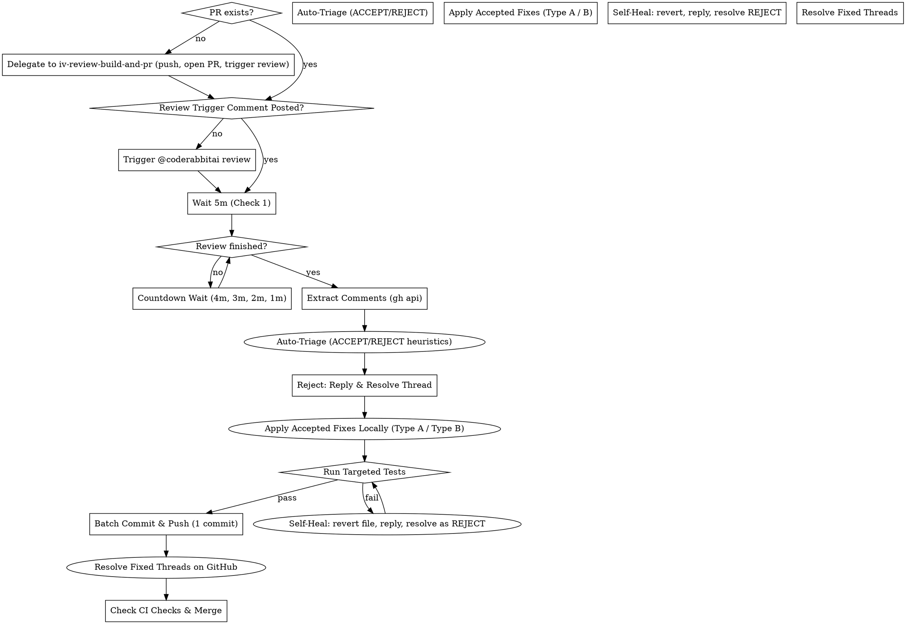

# Station V: Babysit PR and Merge (`v-babysit-pr-and-merge`)

A global, model-agnostic habit: ensure every branch is pushed and opened as a PR (or handed off directly from Station IV `iv-review-build-and-pr`), then sit on the PR through review until it is mergeable. Every comment is triaged, every dismissal carries a reason, review waiting follows a deterministic **5m → 4m → 3m → 2m → 1m** countdown check cycle, the review loop runs **exactly one focused round** (to conserve CodeRabbit quota and eliminate review churn), auto-triggers `@coderabbitai review` if auto-review is not invoked or was skipped, and concludes — merged or escalated.

## Pipeline Position
- **Station:** Station V of VI
- **Previous Station:** `iv-review-build-and-pr` (Review & Ship)
- **Next Station:** `vi-close-pipeline` (Close Pipeline — prune, issue close, clean-exit gate)

**Zero human in the loop.** Extraction, triage, rejection replies, thread resolution, code application, test verification, self-healing, commit, push, and merge are all performed autonomously by the agent. The operator is contacted only if critical blockers cannot be resolved.

## When to use

- Hand-off immediately after Station IV (`iv-review-build-and-pr`) to track CodeRabbit review and merge the PR.
- Working changes or commits exist on a feature branch with no PR yet — Station V delegates opening to `iv-review-build-and-pr`, then starts babysitting once the PR exists.
- A PR was created or pushed, requiring CodeRabbit review tracking.
- Review comments arrive on an open PR.
- Before merging, to confirm zero unhandled blocking feedback.

## Multi-PR Priority Order & Pipelining

Multiple open PRs and no specific number → follow `references/multi-pr-pipelining.md`
(stack dependencies first; pipelining only inside wait windows).

---

## Step Map (load the detail on demand)

| Step | What it does | Detail |
| --- | --- | --- |
| **Step 0** | Ship handshake — find the PR, or delegate to `iv-review-build-and-pr` | `references/review-loop.md` |
| **Step 1** | Verify the `@coderabbitai review` trigger, then wait out the 5m→4m→3m→2m→1m countdown and classify completion honestly | `references/review-loop.md` |
| **Step 2** | Pull every comment via the API; triage each one yourself — ACCEPT or REJECT, no rubber-stamping | `references/triage-and-apply.md` |
| **Step 2B** | Agent fallback review when CodeRabbit is rate-limited, skipped, or stuck on `processing` | `references/triage-and-apply.md` |
| **Step 3** | Late rejections — pointer only, Step 2.4 is the one canonical REJECT flow | `references/triage-and-apply.md` |
| **Step 4** | Apply accepted fixes (Type A suggestions / Type B intent), run targeted tests, self-heal, one batch commit, reply to and resolve every thread | `references/triage-and-apply.md` |
| **Step 5** | GitHub CI is the merge gate; squash-merge, or deploy a `<stack>-build-resolver` persona on failure | `references/merge-and-reset.md` |
| **Step 5a** | Close the issue — verify GitHub auto-closed it via `Closes #<id>`, or close manually if it missed | `references/merge-and-reset.md` |
| **Step 5b** | Return the local checkout to a clean, fast-forwarded base and delete the merged branch | `references/merge-and-reset.md` |

**Round exit condition:** zero unresolved threads carrying a REJECT, and zero threads
resolved without an inline reply. Then CI, then merge, then reset — always, merge or escalate.

---
## The Review Loop


```dot
digraph babysit_pr_and_merge {
    "PR exists?" [shape=diamond];
    "Delegate to iv-review-build-and-pr (push, open PR, trigger review)" [shape=box];
    "Review Trigger Comment Posted?" [shape=diamond];
    "Trigger @coderabbitai review" [shape=box];
    "Wait 5m (Check 1)" [shape=box];
    "Review finished?" [shape=diamond];
    "Countdown Wait (4m, 3m, 2m, 1m)" [shape=box];
    "Extract Comments (gh api)" [shape=box];
    "Auto-Triage (ACCEPT/REJECT)" [shape=box];
    "Reject: Reply & Resolve Thread" [shape=box];
    "Apply Accepted Fixes (Type A / B)" [shape=box];
    "Run Targeted Tests" [shape=diamond];
    "Self-Heal: revert, reply, resolve REJECT" [shape=box];
    "Batch Commit & Push (1 commit)" [shape=box];
    "Resolve Fixed Threads" [shape=box];
    "Check CI Checks & Merge" [shape=box];

    "PR exists?" -> "Delegate to iv-review-build-and-pr (push, open PR, trigger review)" [label="no"];
    "PR exists?" -> "Review Trigger Comment Posted?" [label="yes"];
    "Delegate to iv-review-build-and-pr (push, open PR, trigger review)" -> "Review Trigger Comment Posted?";
    "Review Trigger Comment Posted?" -> "Trigger @coderabbitai review" [label="no"];
    "Review Trigger Comment Posted?" -> "Wait 5m (Check 1)" [label="yes"];
    "Trigger @coderabbitai review" -> "Wait 5m (Check 1)";
    "Wait 5m (Check 1)" -> "Review finished?";
    "Review finished?" -> "Countdown Wait (4m, 3m, 2m, 1m)" [label="no"];
    "Countdown Wait (4m, 3m, 2m, 1m)" -> "Review finished?";
    "Review finished?" -> "Extract Comments (gh api)" [label="yes"];
    "Extract Comments (gh api)" -> "Auto-Triage (ACCEPT/REJECT heuristics)";
    "Auto-Triage (ACCEPT/REJECT heuristics)" -> "Reject: Reply & Resolve Thread";
    "Reject: Reply & Resolve Thread" -> "Apply Accepted Fixes Locally (Type A / Type B)";
    "Apply Accepted Fixes Locally (Type A / Type B)" -> "Run Targeted Tests";
    "Run Targeted Tests" -> "Self-Heal: revert file, reply, resolve as REJECT" [label="fail"];
    "Self-Heal: revert file, reply, resolve as REJECT" -> "Run Targeted Tests";
    "Run Targeted Tests" -> "Batch Commit & Push (1 commit)" [label="pass"];
    "Batch Commit & Push (1 commit)" -> "Resolve Fixed Threads on GitHub";
    "Resolve Fixed Threads on GitHub" -> "Check CI Checks & Merge";
}
```

---


## Standing Rules

- **Zero human in the loop:** Extraction, triage, replies, thread resolution, code application, verification, self-healing, commit, push, and merge run autonomously. Escalate only if critical blockers cannot be resolved.
- **Full autonomy on GitHub operations:** Agent commits, pushes, creates PRs, and merges without requiring manual sign-offs.
- **Mandatory inline reply on every resolution:** Every single resolved thread MUST have an explicit inline reply (`ACCEPT: <summary of fix>` or `REJECT: <concrete technical reason>`) posted before resolution via `repos/:owner/:repo/pulls/:pr/comments/:id/replies`. Never resolve silently, and never run blind bulk resolutions that close unaddressed or newly arrived comments.
- **Programmatic extraction only:** Read review comments via `gh api repos/:owner/:repo/pulls/<pr_number>/comments` (`id`, `path`, `line`, `start_line`, `body`) — never by eyeballing rendered PR HTML.
- **Manual review trigger:** CodeRabbit never auto-reviews. `iv-review-build-and-pr` posts `@coderabbitai review` right after opening the PR; if this skill finds a PR without that trigger comment (opened outside `iv-review-build-and-pr`), it posts it immediately. Never treat a green check as a review — read the check text.
- **Single review round:** Exactly 1 focused review round to conserve CodeRabbit quota and eliminate review churn. Proceed directly to CI verification and merge after resolving round 1.
- **Countdown polling schedule:** 5 min initial wait (hard minimum — never shorten), then 4 min, 3 min, 2 min, and 1 min checks thereafter. Use non-blocking `schedule` tool instead of long shell sleeps.
- **Thoughtful deliberation:** Never blindly reject suggestions. Evaluate each CodeRabbit suggestion on its technical merits against the codebase, domain spec, and architecture. If it genuinely improves performance, safety, or readability, accept and verify with tests. Only reject if it violates domain specs, introduces bloat, or breaks behavior.
- **Descending line order:** When applying edits to a single file, sort hunks in descending `line` order so earlier line anchors do not drift.
- **Operator milestone updates:** Give concise updates on actions taken (`Working on [branch]...`, `Committed & Pushed...`, `PR Opened #...`, `Merged PR #...`).
- **Pipelined multi-PR processing:** Interleave PR tasks during countdown wait windows.
- **One commit per round:** Batch all accepted fixes into a single commit and push once.
- **No auto-fix on partial rejections:** Never run `@coderabbitai auto-fix` when any comments were rejected. Apply fixes locally and test.
- **Never commit red:** If a suggestion breaks a test, `git checkout <file>`, reply with the failure log, resolve as REJECT, and re-run the targeted tests.
- **Repo conventions win:** Always observe repo-specific PR templates and review rules.
- **Post-merge local reset is mandatory:** After every merge (or abandoned-PR escalation), return the checkout to base: confirm `MERGED` via `gh pr view`, switch to base, `git pull --ff-only`, force-delete the local branch (`-D` only after remote confirms `MERGED` — squash merges are never `-d`-deletable), and `git fetch --prune`. Never reset a dirty tree without committing/stashing first; escalate on ambiguity.

---

## VI Triage — Skip or Run? (after Step 5b reset, before the report)

After the local reset lands on a clean base, run these three quick checks to decide the vi-close-pipeline recommendation in the report:

1. **Issue state:** `gh issue view <id> --json state --jq .state` — OPEN = 🔴 (Required).
2. **Leftover artifacts:** `git ls-files --others --exclude-standard | Select-String -Pattern '<id>|tasks/plan|scratch'` — any hit = 🟡 (Recommended); hits from 3+ distinct closed issues = 🟡 even without matching the current id.
3. **Git cleanliness:** `git status --porcelain` — non-empty = 🔴 (Required).

Pick the highest signal: 🔴 > 🟡 > 🟢. All three clean = 🟢 (Skip, continue to `/i-pick-issue`).

---

## Chat Output Contract

Two reports, both in clean everyday English. Never dump raw CodeRabbit text — always condensed and to the point. What's-changed only: no commit hashes or counts, no test commands or counts, no `file:line`, no fix-type letters. Each item names the product location + what was found and what works now.

### Report 1 — Triage Decisions (right after Step 4.4, before merge)

One concise, matter-of-fact line per review comment, in simple language: product location + what was found and what was decided about it. Inline replies on GitHub (`ACCEPT:` / `REJECT:`) still happen for every thread as usual — the chat list only summarizes the decisions. Order the lines most critical first. No full quotes of bot comments:

```markdown
## 🔍 V - PR Babysitting: CodeRabbit Comment Triage:
* **ACCEPT** — [product location + what was found and fixed, in plain words]
* **REJECT** — [what was claimed and why rejected, one short sentence]
```

**HARD RULE — never claim a clean pass when the review never finished.** Pick exactly one ending line:

* If `COMPLETED` with zero inline comments: `No comments found — CodeRabbit completed full review and approved code as-is.`
* If `IN_PROGRESS_STUCK` (only "Currently processing..." placeholder, zero inline, `CodeRabbit` check still `PENDING` after countdown — PR #244 case): `CodeRabbit did not finish review — remained stuck on "processing" past timeout (~16-19m), zero inline comments and zero reviews. This is NOT a clean approval — switched to agent fallback review (Step 2B).`
* If `RATE_LIMITED / SKIPPED` (quota text or false `Pull request is closed` on an open PR): `CodeRabbit did not review — [quote reason: rate-limit / skipped / false-closed]. Switched to agent fallback review (Step 2B).`

### Report 2 — Final Summary (after the Step 5 merge)

```markdown
# 🟢 V - PR Babysitting & Merge: [#<pr_number> - <title>](<url>)

## 🔍 CodeRabbit Review Status:
[one of: Completed full review + N comments addressed / Did not finish — stuck on processing after X minutes, merged via fallback review + green CI / Did not review — rate-limit, merged via fallback review + green CI]
**Branch state after merge:**
* Returned to base branch (`origin/<base>`) and this PR is merged after fixes.

## 🩹 What Was Fixed From Review Comments:
* [product location — what the issue was and how it was fixed, in plain words]
* [fix 2 — ...]

## 🗺️ The Complete Journey:
[3–4 lines: what the problem was ← what was built ← what was found during review ← current status. In plain language, no code jargon.]

---

👉 **Next Step:**
* `/present-pr` — if relevant, run to create a visual presentation.
* [pick one of three — based on dirt check:]
  - 🟢 **Skip** — `Workspace is clean, no sweep needed now. Proceed directly to /i-pick-issue.` ← when no stray tasks/plan.md, no scratch files, issue auto-closed, no dead code detected.
  - 🟡 **Recommended** — `/vi-close-pipeline` — `[specific reason]` ← when 3+ issues accumulated without cleanup, or old tasks/plan.md from previous issues remain, or scratch files left behind.
  - 🔴 **Required** — `/vi-close-pipeline` — `[specific reason]` ← when issue did not close (missing Closes keyword), or verified dead code remains, or git status is not clean after merge.
```

**Timeout-merge rule:** when `IN_PROGRESS_STUCK` or `RATE_LIMITED`, the `CodeRabbit` check may stay `PENDING` forever. Do NOT wait for it. Merge gate = agent fallback review clean (or its nits triaged) + `gh pr checks` green (excluding the stuck `CodeRabbit` context). State this explicitly in the `CodeRabbit Review Status` line so the operator knows the merge was NOT on a completed bot review.
